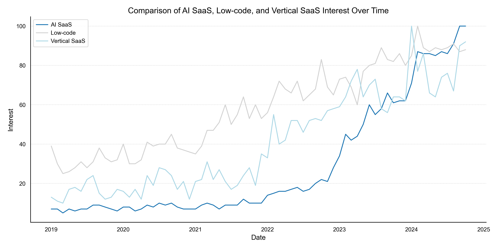

[📥 Download PDF File](https://raw.githubusercontent.com/mrjxtr/research-report-proj/main/reports/SaaS_Industry_Future_Trends_Jester_Lumacad.pdf)

# 📊 Research Report Project

This project focuses on creating visualizations for the research report analysis of trends in AI SaaS, Low-code, and Vertical SaaS interest over time using Python, pandas, and matplotlib. 🐍📈



## 📁 Project Structure

View on `references/folder_structure.txt`

<details>

<summary>Folder Structure</summary>

```plaintext
\research-report-project   <- Project Folder.
│
├── LICENSE                <- Open-source license if one is chosen.
├── README.md              <- The top-level README for developers using this project.
├── requirements.txt       <- The requirements file for reproducing the analysis environment, e.g.
│                             generated with `pip freeze > requirements.txt`.
├── data
│   ├── \processed           <- The final, canonical data sets for modeling.
│   └── \raw                 <- The original, immutable data dump.
│
├── docs                   <- Documentation of business task, deliverables, scope of work, etc.
│
├── notebooks              <- Jupyter notebooks.
│
├── references             <- Data dictionaries, manuals, and all other explanatory materials.
│
├── reports                <- Generated analysis as HTML, PDF, etc.
│   └── \figures             <- Generated graphics and figures to be used in reporting.
│
└── src                    <- Source code for use in this project.
    ├── __init__.py          <- Makes src a Python module.
    │
    ├── plots.py             <- Code to create exploratory and results oriented visualizations.
    │
    ├── utility              <- Scripts that serves as modules to import to make workflow more efficient.
    │   ├── __init__.py
    │   ├── config.py         <- Code to store useful variables and configuration.
    │   ├── plots_cfg.py      <- Code to store plots configuration.
    │   ├── plots_save.py        <- Code for saving plots.

```

</details>

## ✨ Features

1. 📥 Data loading and preprocessing
2. 🎨 Custom plot configuration
3. 📊 Trend comparison visualization
4. 💾 Figure export functionality

## 🧩 Main Components

### 1. Data Processing (`src/plots.py`) 🔄

- Loads raw CSV data for AI SaaS, Low-code, and Vertical SaaS trends
- Cleans and standardizes the data
- Exports processed data to CSV files

<details>

<summary>Code</summary>

```python
# Read data into a DataFrame
df_ai_saas= pd.read_csv(ai_data_path).reset_index()
df_low_code = pd.read_csv(low_code_data_path).reset_index()
df_vertical_saas = pd.read_csv(vertical_saas_data_path).reset_index()


# Clean and preprocess data
def clean_dataframe(df, date_col, interest_col):
    """Clean and standardize dataframe columns."""
    df = df.copy()
    df.rename(
        columns={date_col: "Month", interest_col: "Interest"},
        inplace=True,
    )
    df = df.drop(df.index[0]).reset_index(
        drop=True
    )  # Drop the first row and reset index
    df["Month"] = pd.to_datetime(df["Month"])
    df["Interest"] = pd.to_numeric(
        df["Interest"], errors="coerce"
    )  # Convert Interest to numeric
    return df


# Apply cleaning function to each dataframe
df_ai_saas = clean_dataframe(df_ai_saas, "index", "Category: All categories")
df_low_code = clean_dataframe(df_low_code, "index", "Category: All categories")
df_vertical_saas = clean_dataframe(
    df_vertical_saas, "index", "Category: All categories"
)

# Export data into data folder
export_path = os.path.abspath(os.path.join(script_dir, "../data/processed"))
df_ai_saas.to_csv(os.path.join(export_path, "df_ai_saas.csv"), index=False)
print(df_ai_saas.head())
df_low_code.to_csv(os.path.join(export_path, "df_low_code.csv"), index=False)
print(df_low_code.head())
df_vertical_saas.to_csv(os.path.join(export_path, "df_vertical_saas.csv"), index=False)
print(df_vertical_saas.head())
print(f"Data exported to {export_path}")
```

</details>

### 2. Data Visualization (`src/plots.py`) 📈

- Creates a line chart comparing all three datasets
- Customizes plot appearance
- Exports the figure as a PNG file

<details>
<summary>Code</summary>

```python
# Create a line chart comparing all three datasets
fig, ax = plt.subplots(figsize=(12, 6))

# Plot each dataset
ax.plot(df_ai_saas["Month"], df_ai_saas["Interest"], label="AI SaaS")
ax.plot(
    df_low_code["Month"], df_low_code["Interest"], label="Low-code", color="lightgray"
)
ax.plot(
    df_vertical_saas["Month"],
    df_vertical_saas["Interest"],
    label="Vertical SaaS",
    color="lightblue",
)

# Customize the plot
ax.set_title("Comparison of AI SaaS, Low-code, and Vertical SaaS Interest Over Time")
ax.set_xlabel("Date")
ax.set_ylabel("Interest")
ax.legend()
plt.tight_layout()

plt.show()

# Path for exporting figures
export_dir: str = os.path.abspath(os.path.join(script_dir, "../reports/figures/"))
export_figs(
    export_dir, fig, 1, "Comparison_AI_SaaS_Low_code_Vertical_SaaS_Interest.png"
)

# Close the figure to free up memory
plt.close(fig)
print(f"Figure saved to {export_dir}")
```

</details>

### 3. Plot Configuration (`src/utility/plots_cfg.py`) 🎨

- Defines a custom color palette
- Applies consistent theming across plots using Matplotlib and Seaborn

### 4. Figure Export (`src/utility/plots_save.py`) 💾

- Provides a function to export figures generated with matplotlib/seaborn

## 🚀 Usage

1. Ensure all required dependencies are installed (pandas, matplotlib, seaborn).
2. Place raw CSV data files in the `data/raw/` directory.
3. Run the `src/plots.py` script to process data, generate visualizations, and export results.

## 📤 Output

- Processed CSV files will be saved in the `data/processed/` directory.
- The generated figure will be saved as a PNG file in the `reports/figures/` directory.

## 🛠️ Customization

To modify plot aesthetics or add new visualizations, refer to the `src/utility/plots_cfg.py` file for theme settings and color palette definitions.

[📥 Download PDF File](https://raw.githubusercontent.com/mrjxtr/research-report-proj/main/reports/SaaS_Industry_Future_Trends_Jester_Lumacad.pdf)
